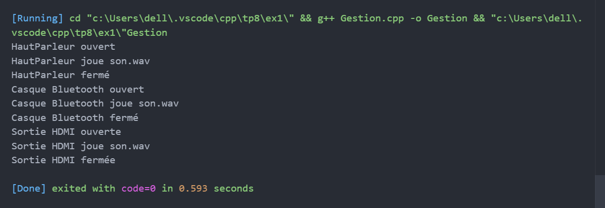
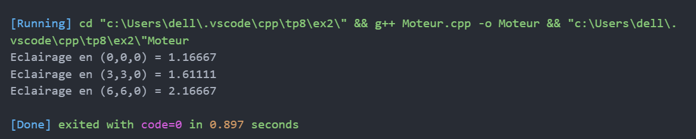
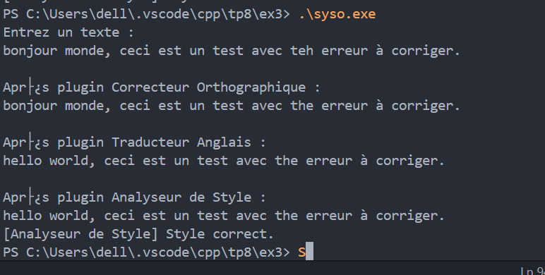

# TP8 : Polymorphisme et classes virtuelles

## Exercice 1 — Gestion périphériques audio  
Interface abstraite et classes dérivées, test polymorphe.

---

## Exercice 2 — Moteur de rendu 3D  
Types de lumières, calcul intensité, pointeurs intelligents.

---

## Exercice 3 — Plugins traitement de texte  
Interface plugin, transformations successives d’un texte.

